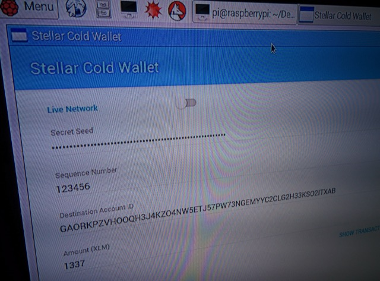
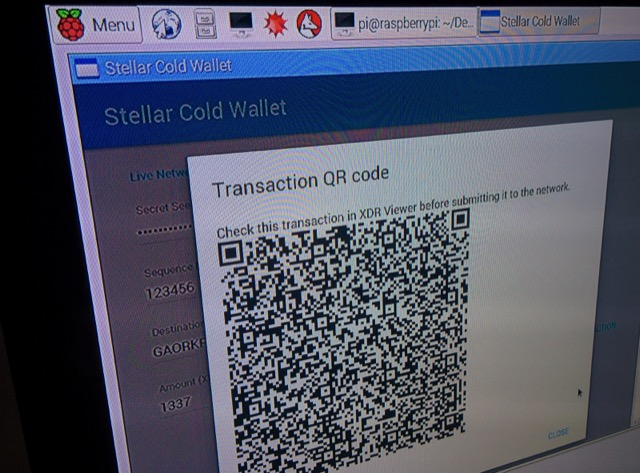

> This project is no longer maintained because of a [bug in atom/electron](https://github.com/atom/electron/issues/3719).
>
> **[cold](https://github.com/bartekn/cold)** is a better alternative.


# stellar cold wallet

**Do not use - it contains bugs!**

Simple offline transaction builder/signer app that can be executed on ARM machines (and other architectures supported by [electron](http://electron.atom.io/)).

After building a transaction it displays a XDR as QR code.

Inspired by [wallet-one](https://github.com/nullstyle/wallet-one) by [@nullstyle](https://github.com/nullstyle).

Form view  | QR code dialog
------------- | -------------
  | 


## TODO

* **Bundle using webpack** (this will simplify release process, make builds smaller and improve app speed),
* Switch to tar.gz to persist file permissions,
* Generating random keypairs,
* Support all operations,
* Support memo.

## Development

```
npm install
electron .
```

Right now you need to restart `electron` every time a change is made. The process will be improved in the future.

## ARM build

```
./release.sh
```

Project will be built to `dist` folder.
